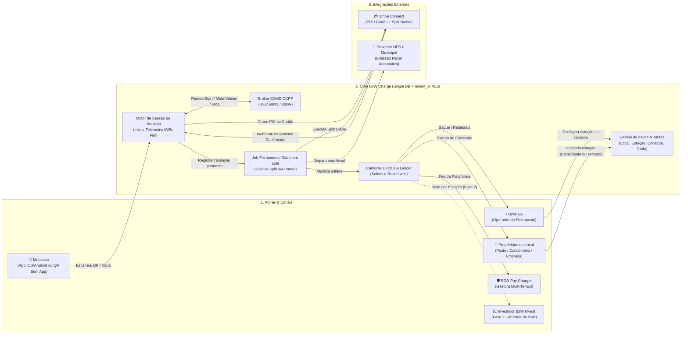
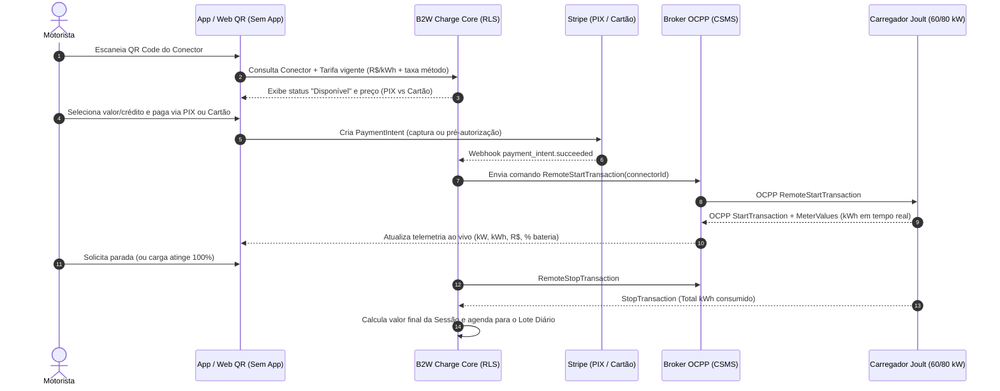
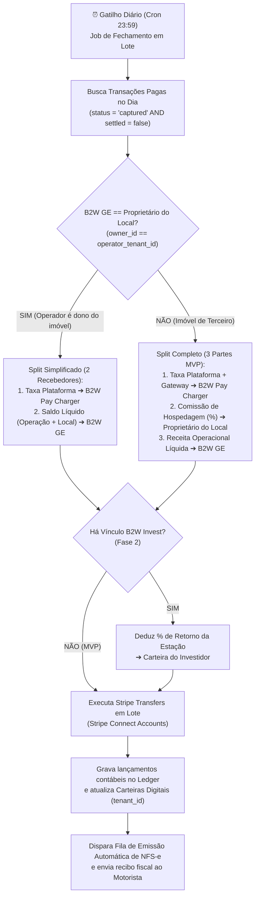
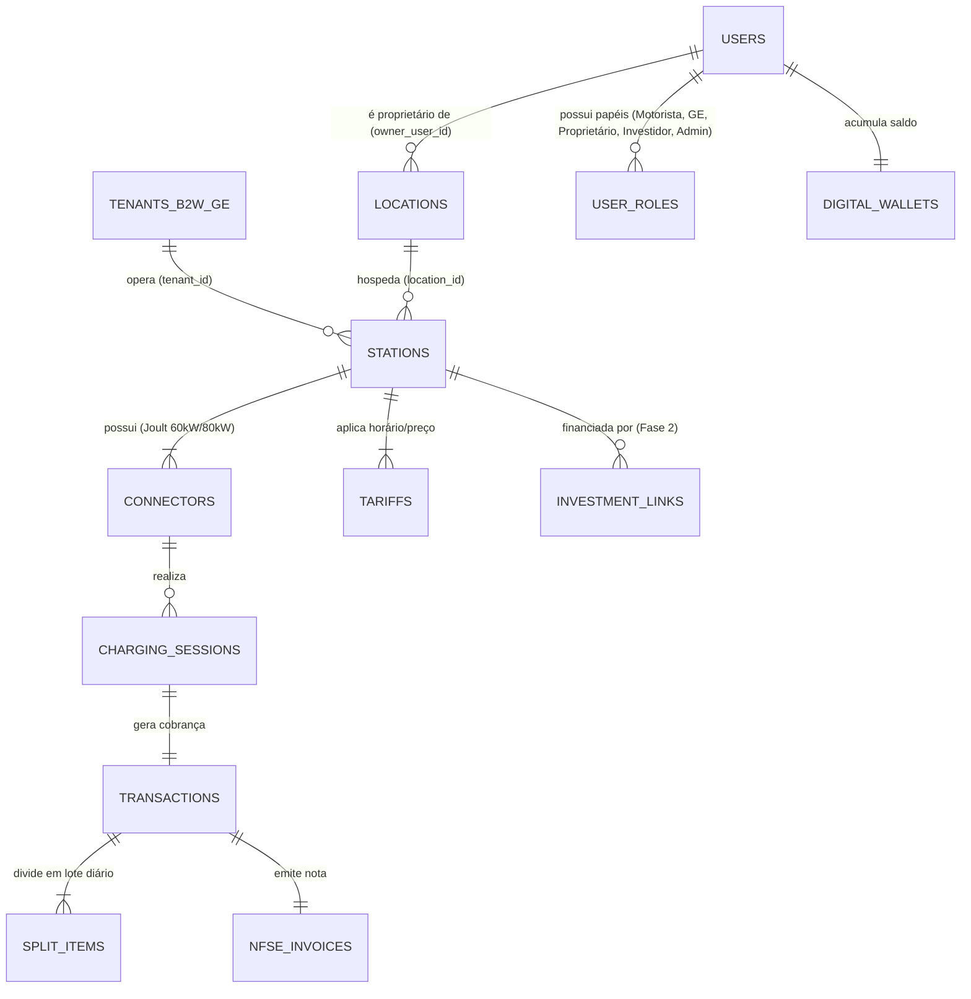

# B2W Charge — Arquitetura de Domínio de Negócio e Fluxogramas Técnicos

> **Documento de Especificação para o Time de Desenvolvimento**
> **Ecossistema:** B2W (B2W Pay Charger · B2W GE · B2W Invest · B2W Energia)
> **Diferencial Estrutural:** Split financeiro nativo de **3 partes no MVP** (`B2W Pay Charger` + `B2W GE` + `Proprietário do Local`) e **4 partes na Fase 2** (`+ Investidor B2W Invest`).

---

## 1. Decisões de Arquitetura Consolidadas (ADRs)

| Dimensão Técnica | Decisão Definida | Impacto na Arquitetura |
| :--- | :--- | :--- |
| **Multi-Tenancy & Banco** | **Banco Único com `tenant_id` + Row-Level Security (RLS)** | Isolamento lógico rigoroso por operador (`B2W GE`), permitindo que a `B2W Pay Charger` tenha visão consolidada global e que um `Usuário` ou `Proprietário` acesse múltiplos tenants quando aplicável. |
| **Hardware & Protocolo** | **Carregadores Joult (60 kW e 80 kW) via OCPP 1.6J / 2.0.1** | Servidor CSMS WebSocket gerenciando `BootNotification`, `StatusNotification`, `RemoteStartTransaction`, `MeterValues` (kWh em tempo real) e `StopTransaction`. |
| **PSP & Split Financeiro** | **Stripe (Stripe Connect / Marketplace) — PIX e Cartão** | Captura do pagamento na sessão (App ou QR Code sem App) com taxas diferenciadas por meio (PIX < Cartão) e subcontas conectadas (`stripe_account_id`) para cada `B2W GE` e `Proprietário`. |
| **Motor de Liquidação** | **Fechamento Diário em Lote (Daily Batch Settlement)** | As sessões concluídas no dia acumulam no razão transitório (`ledger_entries`) e um Cron Job diário consolida e executa as transferências/splits na Stripe, reduzindo custo operacional e facilitando conciliação. |
| **Compliance Fiscal** | **Emissão Automática de NFS-e Municipal** | Disparo assíncrono via fila pós-liquidação da transação, respeitando as regras tributárias do município da estação (Lei 14.300 / REN 1000 ANEEL). |

---

## 2. Mapa Geral de Domínios e Conexões (Visão Executiva)

---

## 3. Fluxograma 1: Jornada de Recarga (OCPP Joult 60/80kW + Stripe)

---

## 4. Fluxograma 2: Motor de Fechamento Diário em Lote (Split 3/4 Partes + NFS-e)

---

## 5. Modelagem de Dados Multi-Tenant (`tenant_id` + RLS)

